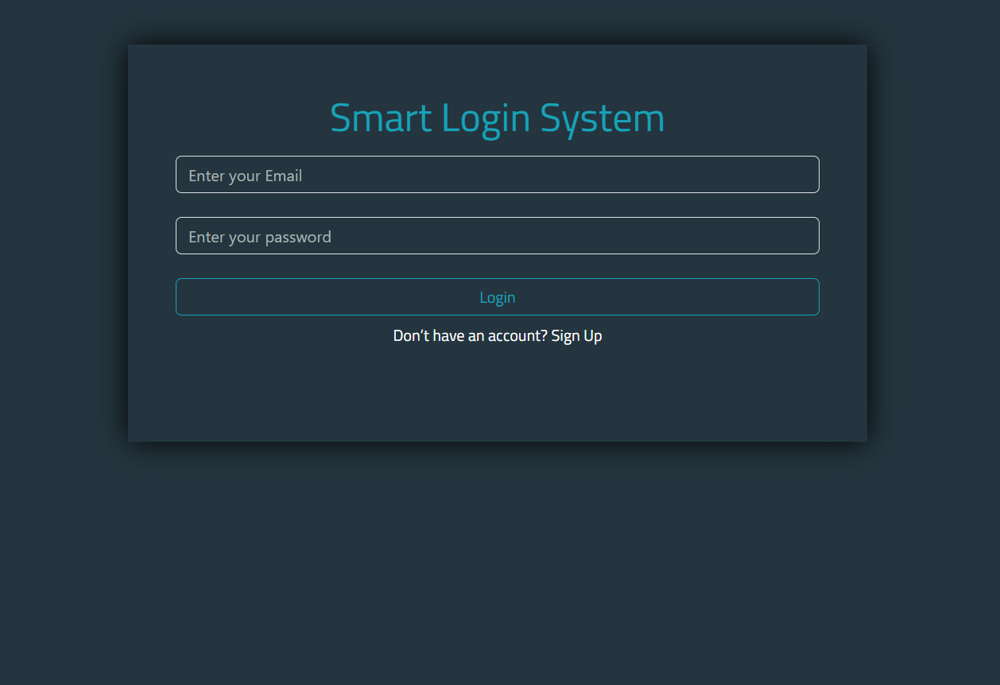
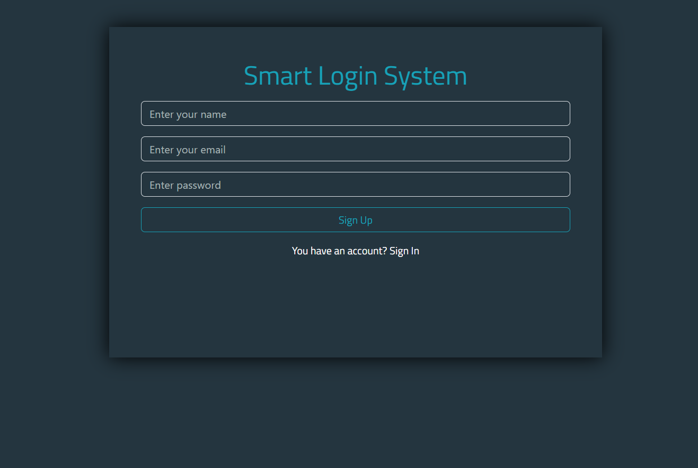
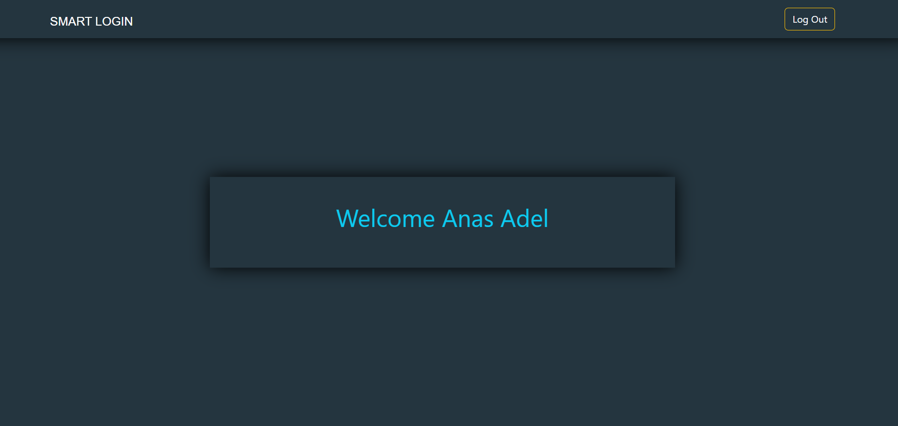

# Smart Login System

A simple and secure client-side Smart Login System designed for user authentication. This project allows users to register, log in, and navigate to a personalized welcome page, with all user data managed efficiently in local storage.

---

##### 🌐 visit the website: [Smart Login Live Demo](https://anas26772001.github.io/LoginForm/)

#### 🚀 Preview our pages

## 🚀 Login Page :

## 🚀 Registration Page :

## 🚀 Welcome Page :

## Features

- **User Registration**: Allows new users to create an account with a name, email, and password.
- **User Login**: Authenticates existing users based on their registered email and password.
- **Persistent User Data**: User credentials are saved securely in the browser's **local storage**, ensuring data persists across browser sessions.
- **Welcome Dashboard**: Displays a personalized welcome message for the logged-in user.
- **Input Validation**: Checks for required fields to ensure no input is left empty during sign-up or login.
- **Duplicate Email Detection**: Prevents multiple users from registering with the same email address.
- **Alert Messages**: Provides clear feedback to users regarding input requirements, successful operations, or errors (e.g., incorrect credentials, email already exists).
- **Seamless Navigation**: Easy navigation between login, sign-up, and home pages.
- **Logout Functionality**: Allows users to securely log out of their session.
- **Responsive Design**: Utilizes Bootstrap for a modern and responsive user interface.

---

## Technologies Used

- **HTML5**: Provides the structure for the login, sign-up, and home pages.
- **CSS3**: Custom styling (`style.css`) for visual design, complemented by **Bootstrap 5.3.3** for responsive layouts and UI components.
- **JavaScript (ES6+)**: Handles all client-side logic, including user authentication (sign-up, login, logout), data management with `localStorage`, and DOM manipulation for dynamic content and alerts.
- **Google Fonts**: Used for enhancing the typography.

---

## Usage

### Sign Up

1.  From the login page (`index.html`), click on "Sign Up" (if you're on the login page) or directly open `sign-up.html`.
2.  Fill in your **Name**, **Email**, and **Password**.
3.  Click the **"Sign Up"** button.
4.  You'll see a "Success" message if registration is successful, or an alert if inputs are missing or the email already exists.
5.  After successful registration, you can click "Sign in" to go to the login page.

### Login

1.  Open the `index.html` file (the Login page).
2.  Enter your registered **Email** and **Password**.
3.  Click the **"Login"** button.
4.  If credentials are correct, you will be redirected to the `home.html` welcome page. If incorrect, an "Incorrect Info" alert will appear.

### Welcome Page

- After successful login, you'll be redirected to `home.html`, which displays a personalized "Welcome [Your Name]" message.

### Logout

1.  On the welcome page (`home.html`), click the **"Log out"** button in the navigation bar.
2.  This will redirect you back to the login page (`index.html`), effectively ending your session.

---

## Project Structure
